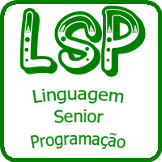
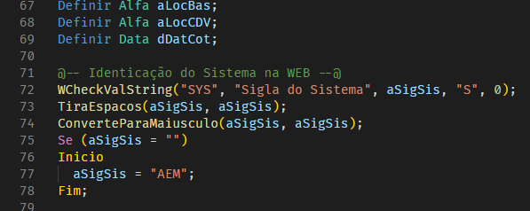
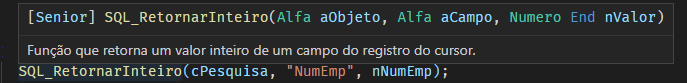
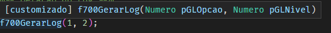
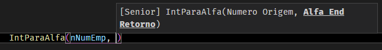
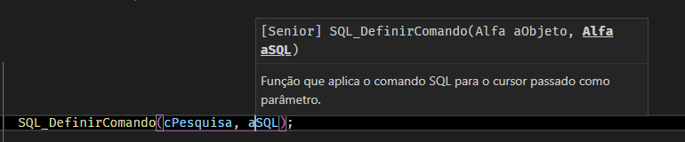
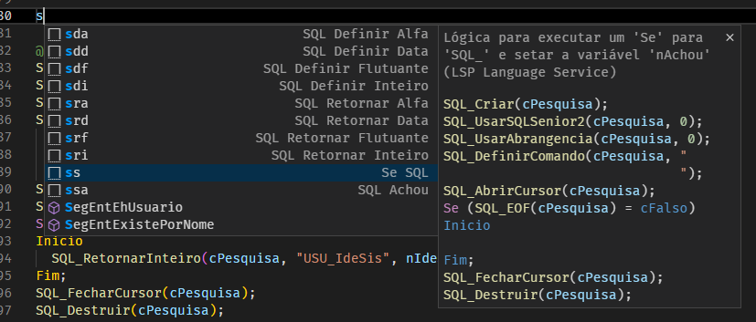

 

  

  <h2 align="center">LSP para Visual Studio Code</h2>

  

    Esta extensão adiciona o suporte à <b>Linguagem Senior de Programação</b>, também conhecida como LSP, ao Visual Studio Code.
  

Aqui estão alguns dos recursos que o **LSP** oferece:

* Colorização
* Autocomplete
* Apresentação de parâmetros das funções (nativas e customizadas)
* Snippets (trechos de códigos previamente configurados)

 
 

# **Recursos**

## Colorização

Suporta colorização da maioria das funções internas, variáveis de sistema e palavras-chave para o LSP para o [Vetorh](https://www.senior.com.br/)

 

## Autocomplete

Durante a digitação da regra, é apresentado uma lista de sugestões de funções ou variáveis de possíveis alternativas ao texto digitado.
 

## Apresentação de parâmetros das funções

Ao passar o mouse sobre um função é apresentado um popup com a lista de parâmetros e a documentação disponíveis.

**Funções nativas**

**Funções customizadas**

Durante a digitação são mostrados todos os parâmetros necessários e destacado o que está sendo preenchido no momento.

Posicionando o cursor em um parâmetro e prescionando `CTRL+SHIFT+Space` são apresentadas informações detalhadas sobre o parâmetro correspondente.

## Snippets

Diversos trechos de códigos comuns para o dia-a-dia

 

## Licença

Este projeto é licenciado sobre a licença MIT - veja [`LICENSE.md`](LICENSE.md) para mais informações.

## Autor

Luciano Cargnelutti - [https://llutti.dev](https://llutti.dev/)

Repositório do Projeto: [https://github.com/llutti/vscode-language-lsp](https://github.com/llutti/vscode-language-lsp)