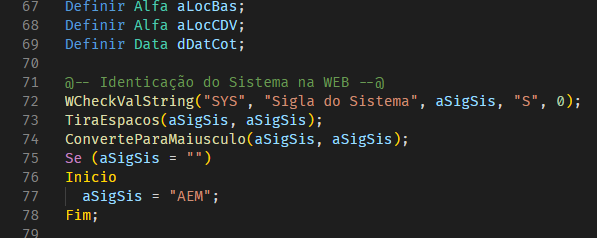
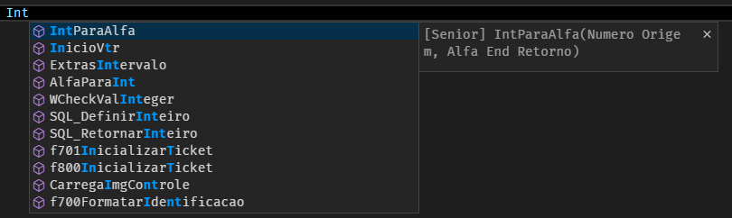
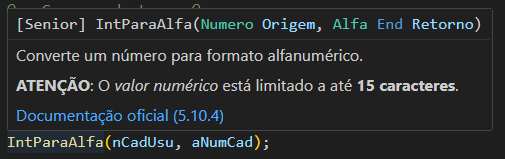
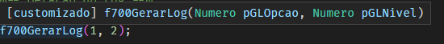
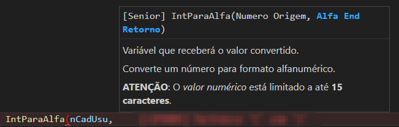
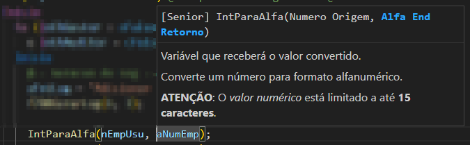
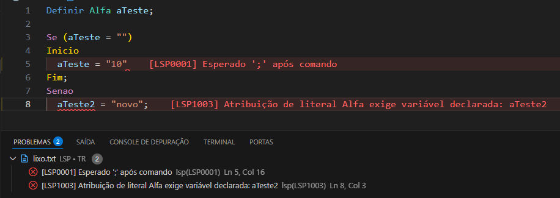
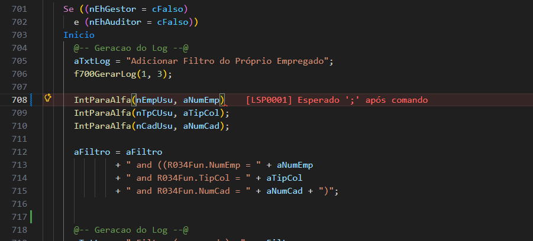
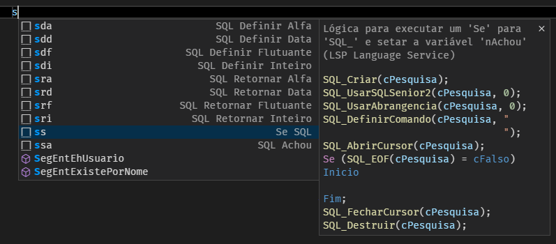

<br />
<p align="center">
  <a href="https://github.com/llutti/vscode-language-lsp">
    
  </a>

  <h2 align="center">LSP para Visual Studio Code</h2>

  <p align="center">
    Suporte à <b>Linguagem Senior de Programação</b> no Visual Studio Code com compilador dedicado,
    validação por contexto, destaque semântico, formatação de código, correções rápidas e tutorial guiado.
  </p>

  <p align="center" style="display:flex;gap:7px;justify-content:center;align-items:center;">
    
    
    
    
    
  </p>
</p>

## Visão geral

A extensão reúne, no fluxo normal do editor:

- destaque semântico para funções, variáveis, parâmetros e membros da linguagem
- autocompletar para funções, variáveis, `Cursor`, `Lista` e snippets
- hover com assinatura, documentação e ajuda de parâmetro
- validação sintática e semântica por arquivo ou por contexto
- modo `SingleFile` para arquivos fora de contexto
- correções rápidas e controle de diagnósticos por ID
- formatação de código com `Format Document`
- suporte opcional a SQL embutido com formatação e highlight dedicados
- tutorial guiado para configuração inicial

---

## Começo rápido

### 1. Abra um arquivo LSP

O padrão oficial é a extensão **`.lspt`**. Arquivos com essa extensão já são reconhecidos automaticamente.

### 2. Associe `.txt` à linguagem LSP, se necessário

Se você ainda trabalha com arquivos `.txt`, prefira associar apenas os arquivos da regra no workspace:

```json
{
  "files.associations": {
    "**/HR/HR*.txt": "lsp",
    "**/QL/QL*.txt": "lsp",
    "**/RS/RS*.txt": "lsp",
    "**/SM/SM*.txt": "lsp",
    "**/TR/TR*.txt": "lsp"
  }
}
```

### 3. Decida como quer trabalhar

Use a extensão de duas formas:

- **SingleFile**: para editar um arquivo isolado, sem configurar contexto
- **Contexto**: para validar múltiplos arquivos relacionados dentro de uma pasta

---

## Modos de uso

### Contextos de validação

Use contextos quando quiser trabalhar com múltiplos arquivos relacionados, simulando um módulo real da regra.

Exemplo em `.vscode/settings.json`:

```json
{
  "lsp.contexts": [
    {
      "name": "HR",
      "rootDir": "HR",
      "filePattern": "HR*.lspt",
      "includeSubdirectories": false,
      "system": "HCM"
    },
    {
      "name": "TR",
      "rootDir": "TR",
      "filePattern": "re:^\\d+.*\\.txt$",
      "includeSubdirectories": false,
      "system": "HCM"
    }
  ]
}
```

Nesse segundo contexto, a regex aceita arquivos como:

- `805 - Cadastro de Eventos.txt`
- `001 Regra TR.txt`
- `2024 Fechamento.txt`

Regras importantes:

- um workspace pode ter múltiplos contextos
- cada arquivo pertence a um único contexto
- diagnósticos, símbolos e validações não vazam entre contextos
- o sistema `SENIOR` é sempre carregado automaticamente
- no contexto, você configura apenas o sistema adicional (`HCM`, `ACESSO` ou `ERP`)

**Comandos relacionados**

- `LSP: Criar Contexto`
- `LSP: Editar Contexto`
- `LSP: Remover Contexto`
- `LSP: Validar Contextos`
- `LSP: Abrir Configurações de Contexto`

### Arquivo único (`SingleFile`)

Se o arquivo LSP estiver fora de qualquer contexto configurado, a extensão entra automaticamente em modo **SingleFile**.

Nesse modo:

- o arquivo é tratado isoladamente
- não existe varredura da pasta
- o sistema adicional pode ser selecionado na barra de status
- a troca de sistema é permitida somente nesse cenário

Você pode definir um sistema padrão com:

```json
{
  "lsp.fallback.defaultSystem": "HCM"
}
```

Ou usar o comando:

- `LSP: Selecionar Sistema (Fallback)`

---

## Recursos principais

### Tutorial guiado

Ao instalar a extensão, o VS Code exibe um tutorial com os pontos principais:

- configuração de contextos
- uso de `SingleFile`
- controle de diagnósticos
- correções rápidas
- formatação

Também é possível reabrir manualmente pesquisando por `Abrir Tutorial` na Paleta de Comandos.

### Destaque semântico

O destaque semântico cobre:

- funções internas e customizadas
- variáveis internas e customizadas
- parâmetros e assinaturas
- membros de `Cursor` e `Lista`
- campos dinâmicos de `Lista` criados via `.AdicionarCampo(...)`
- SQL embutido elegível, quando o highlight correspondente estiver habilitado



### Autocompletar

Durante a digitação, a extensão apresenta sugestões para:

- funções internas
- funções customizadas
- variáveis globais e locais
- métodos e propriedades de `Cursor`
- métodos e propriedades padrão de `Lista`
- campos dinâmicos adicionados semanticamente por `.AdicionarCampo(...)`
- snippets da linguagem



### Hover e ajuda de assinatura

Ao passar o mouse sobre uma função, a extensão exibe assinatura, parâmetros e documentação disponível.

Também:

- funções internas usam assinaturas pré-definidas
- funções customizadas exibem assinatura inferida do projeto
- o hover pode incluir o link **Documentação oficial** quando a assinatura possuir `docUrl`
- `Ctrl+Shift+Space` mostra o parâmetro atual durante a digitação

**Funções internas**



**Funções customizadas**



**Ajuda durante a digitação**



**Detalhes do parâmetro atual**



### Ir para definição

Ao usar `Ctrl+Clique` ou `F12` sobre uma função customizada, o editor navega para o ponto onde ela foi definida.

### Validação sintática e semântica

A extensão valida o código durante a digitação e ao abrir o arquivo.

Isso inclui:

- erros sintáticos de blocos e delimitadores não fechados
- validação semântica de funções internas e customizadas
- validação de tipos em atribuições
- regras específicas de `Cursor`, `Lista`, `ExecSql` e variáveis internas
- controle de variáveis não utilizadas e conflitos de escopo



### Diagnósticos por ID e correções rápidas

A extensão permite:

- ignorar IDs por workspace ou usuário com `lsp.diagnostics.ignoreIds`
- ignorar IDs por contexto com `lsp.contexts[].diagnostics.ignoreIds`
- listar e limpar IDs ignorados por comando
- aplicar correções rápidas com confirmação segura de nome quando necessário

**Comandos relacionados**

- `LSP: Ignorar ID de Diagnóstico`
- `LSP: Parar de Ignorar ID de Diagnóstico`
- `LSP: Listar IDs de Diagnóstico Ignorados`
- `LSP: Limpar IDs Ignorados de Diagnóstico (Workspace)`
- `LSP: Limpar IDs Ignorados de Diagnóstico (Usuário)`
- `LSP: Aplicar Quick Fix (Confirmar Nome)`
- `LSP: Aplicar Plano de Edição do Quick Fix`

**Fluxo ilustrado**



### Formatação de código

O uso recomendado é pelo comando padrão do VS Code:

- `Format Document`

A formatação:

- formata o documento inteiro
- altera apenas espaços, indentação e quebras de linha
- preserva o conteúdo de comentários
- preserva strings em geral, com exceção do SQL embutido elegível quando a formatação dedicada estiver habilitada
- preserva o EOL original (`CRLF` ou `LF`)
- aplica um layout canônico e consistente

Quando a feature de SQL embutido está habilitada, a extensão pode formatar SQL em contextos reconhecidos e seguros, incluindo casos suportados de concatenação estática e `SQL_DefinirComando(..., variável)` reconstruível no mesmo bloco.

Configuração básica:

```json
{
  "lsp.format.enabled": true,
  "lsp.format.indentSize": 2,
  "lsp.format.useTabs": false,
  "lsp.format.maxParamsPerLine": 4,
  "lsp.format.embeddedSql.enabled": false,
  "lsp.format.embeddedSql.dialect": "sql"
}
```

### SQL embutido

A extensão oferece suporte opcional para SQL embutido em trechos reconhecidos da linguagem, como `ExecSql`, `ExecSQLEx`, `<cursor>.SQL` e `SQL_DefinirComando`.

Com a funcionalidade habilitada, a extensão pode:

- formatar SQL embutido em casos seguros
- aplicar highlight dedicado ao trecho SQL elegível
- respeitar o dialeto configurado
- manter `no-op` em casos ambíguos ou dinâmicos não suportados

Configuração recomendada:

```json
{
  "lsp.format.embeddedSql.enabled": false,
  "lsp.format.embeddedSql.dialect": "sql",
  "lsp.semantic.embeddedSqlHighlight.enabled": false
}
```

Dialetos disponíveis:

- `sql`
- `oracle`
- `sqlserver`

### Trechos prontos

Diversos snippets continuam disponíveis para acelerar comandos comuns da linguagem.



---

## Configurações principais

| Chave | Default | Finalidade |
|---|---:|---|
| `lsp.contexts` | `[]` | Define contextos multiarquivo por diretório |
| `lsp.fallback.defaultSystem` | vazio | Define o sistema adicional padrão para `SingleFile` |
| `lsp.format.enabled` | `true` | Liga ou desliga a formatação |
| `lsp.format.indentSize` | `2` | Define o tamanho da indentação |
| `lsp.format.useTabs` | `false` | Usa tabs em vez de espaços |
| `lsp.format.maxParamsPerLine` | `4` | Controla quebra de parâmetros na impressão canônica |
| `lsp.format.embeddedSql.enabled` | `false` | Habilita formatação dedicada para SQL embutido |
| `lsp.format.embeddedSql.dialect` | `"sql"` | Escolhe o dialeto do SQL embutido |
| `lsp.semantic.embeddedSqlHighlight.enabled` | `false` | Habilita highlight dedicado para SQL embutido |
| `lsp.refactor.defaultBlockStyle` | `"inicioFim"` | Define o estilo padrão dos refactors de bloco |
| `lsp.diagnostics.ignoreIds` | `[]` | Ignora diagnósticos por ID no escopo configurado |
| `lsp.onboarding.showOnUpdate` | `true` | Controla a reabertura do tutorial |
| `lsp.onboarding.neverShowAgain` | `false` | Impede a reabertura automática do tutorial |

---

## Exemplos de configuração

### Contextos básicos

```json
{
  "lsp.contexts": [
    {
      "name": "HR",
      "rootDir": "HR",
      "filePattern": "HR*.txt",
      "includeSubdirectories": false,
      "system": "HCM"
    },
    {
      "name": "TR",
      "rootDir": "TR",
      "filePattern": "re:^\\d+.*\\.txt$",
      "includeSubdirectories": false,
      "system": "HCM"
    }
  ]
}
```

### Formatter com SQL embutido

```json
{
  "lsp.format.enabled": true,
  "lsp.format.embeddedSql.enabled": true,
  "lsp.format.embeddedSql.dialect": "oracle",
  "lsp.semantic.embeddedSqlHighlight.enabled": true
}
```

### Refactors com bloco em chaves

```json
{
  "lsp.refactor.defaultBlockStyle": "braces"
}
```

---

## Licença

Este projeto é licenciado sob a licença MIT. Veja [`LICENSE.md`](LICENSE.md) para mais informações.

## Autor

Luciano Cargnelutti - [https://llutti.dev](https://llutti.dev/)

Repositório do projeto: [https://github.com/llutti/vscode-language-lsp](https://github.com/llutti/vscode-language-lsp)
